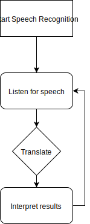
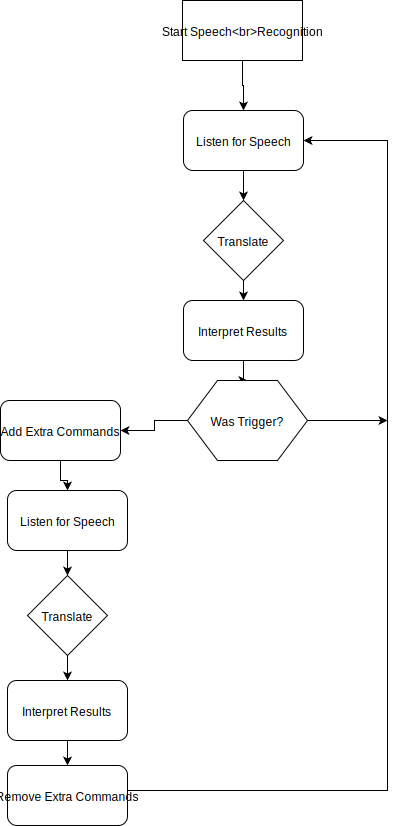

Voice User Interfaces (VUI) are popping up just about everywhere these days.  From virtual assistants on your mobile phones, to virtual assistants via smart speakers in your home, to even having virtual assistants in your car.

For some, this is their idea of dystopian hell.  For others, it's their idea of a utopian paradise.

If you're in the business of building for the web and are in the latter camp (or at least someway towards it) then lets look at how we can bring VUI to the web.

## VUI?  VDI? WTF? BBQ!

The title of the post is VUI meaning Voice User Interfaces which is an interface akin to the lower end Amazon Echo Dot or Google Home/Mini devices in that you speak to it, it speaks back to you, and then you rinse-and-repeat until one of you gives up.  What we're trying to do in bringing this technology to the web in its current status is not really VUI in the purest sense, it is more along the lines of "Voice Driven Interfaces", however, you'll just see the term VUI used as a catch-all.

### Current (Sep 2019) Speech Recognition Browser Support

Speech Recognition API currently only available on Chrome/Edge Dev.  It is available on Firefox, but, only under a development flag and will hopefully be available in the not too distant future.

The speech synthesis API is actually very well supported, but how "natural" it sounds will vary from browser to browser.

### Introduction to the speech regcognition and speech synthesis API

We will look at getting up and running from the ground up.  We just want to dip our toe in the water so here is the simplest demo: Pumpkin the Parrot! ([https://heuristic-hawking-e8bb43.netlify.app/](https://heuristic-hawking-e8bb43.netlify.app/))

This demo attempts to translate the user's speech and speak back what the browser thinks the user has said.

The code for this app is fairly straight forward and can be viewed here: [https://github.com/huntlyc/Pumpkin-The-Parrot/blob/master/index.html](https://github.com/huntlyc/Pumpkin-The-Parrot/blob/master/index.html)

Here's some code used to start the speech recognition service and keep it running:

```javascript
let recognition;

try{
    window.SpeechRecognition = window.SpeechRecognition ||  window.webkitSpeechRecognition;

    recognition = new SpeechRecognition();
    //Set lang to english
    recognition.lang = 'en-US';
    //Set to continually run (your mileage may vary)
    recognition.continuous = true;
    //Wait until user has stopped speaking before sending off for analysis
    recognition.interimResults = false;
    //Try and just get the best possible match
    recognition.maxAlternatives = 1;

    try{
        recognition.start();
        recognition.onresult = (e) => {
            //service stores history of all our results, grab the latest
            const userSpeech = e.results[e.results.length -1][0].transcript;

            //You've now got what the recognition service thinks the user said as a string
            alert(userSpeech);
        };
    }catch(e){ // already started, try again
        console.log(e);
        window.setTimeout(1000, startSpeechRecognition);
    }
    /**
        * There's no easy way to detect when the
        * browser has killed the session and stopped
        * listening in on the mic.
        *
        * So attempt to restart the session on
        * each audioend event.
        *
        * [Fired when the user agent has finished capturing audio].
        **/
    recognition.onaudioend = () => {
        startSpeechRecognition();
    };
}catch(e){
    alert('Sorry, speech recognition is not available for this browser');
}
```

We create a "voice loop" in the code because the browser can stop listening at any point.  

### Making VUI Easier With Annyang

If you look at the source code for that parrot demo, you'll see that there is a lot going on for such a simple application.  Also, just throwing back what the user has said isn't very useful.  If you want to act on what your user is saying, then you had better sharpen up your JS regex skills!!!

Thankfully, the annyang library will effectively abstract out speech recognition implementation details and act as a mail man between your app and the browsers speech recognition API.

It also allows us to trigger a specific function if the returned speech matches a certain phrase.

### Annyang Demo

Before we go into the implementation details of annyang, here is a demo of an evolution of our first parrot demo where now instead of repeating back what we say, we instead can ask it a few simple questions:

- What's your name?
- How old are you?
- Is pineapple a good pizza topping?
- What's your favourite [Pizza/Ice Cream/Drink]

You can view the demo here: [https://heuristic-hawking-e8bb43.netlify.app/annyang.html](https://heuristic-hawking-e8bb43.netlify.app/annyang.html)

### Annyang Basics

Now you've seen the demo, let's touch back on what's going on here:

**Setup**

This is straight forward, we include the annyang cdn script into our page and then, in our JavaScript, ask if annyang is available.  If so, it means that we've included the library correctly and the browser supports the speech recognition API.  If either of those things are false, we won't do anything.

```html
    <!-- ... -->
    <script src="//cdnjs.cloudflare.com/ajax/libs/annyang/2.6.0/annyang.min.js"></script>
    <script>
        if(annyang){
            // do speech stuff
        }else{
            alert('speech recognition not available on your browser');
        }
    </script>
</body>
```

**Adding commands**

Annyang commands are a phrase/function pair and we group these pairs in a literal object

```javascript
    const commands = {
        'Whats your name': sayName,
        'How old are you': sayAge,
        'Is pineapple a good pizza topping': freakOut,
        'Whats your favourite :thing': favThing
    };

    function sayName(){ /* ... */ }
    function sayAge(){ /* ... */ }
    function freakOut(){ /* ... */ }
    function favThing(thing){ /* ... */ }

    if(annyang){
        annyang.start();
        annyang.addCommands(commands);
    }
```

We can then pass our command object to the annyang `addCommands()` method.

In the case of "What's your favourite [Pizza/Ice Cream/Drink]" we can tell annyang to extract the "thing" being asked for into a variable.  This avoids us repeating each iteration of the command and allows us to easily add additional favourite things by just editing the associated function.

### The Standard VUI Flow

Once the microphone permissions have been granted and annyang is started, it will continuously sit and listen for commands.  



_Standard Speech Recognition Loop_

### A Better VUI Flow

A standard VUI loop may be what you're after, but likely it will be more annoying than it is helpful.  The solution, a keyword trigger.

In the same way as Amazon Echo devices have "Alexa", or Google's assistant/home devices have "OK Google", you may find that it's more beneficial for your user to first trigger your VUI and then speak their command.

The flow for this would be:

- Start annyang and only add one command: your trigger command
- Once triggered, add in all your additional commands
- Once done, or no speech detected, remove these commands so we go back to only having our trigger command



### Trigger Demo

Same as previous demo but you need to trigger Pumpkin the Parrot by saying "Pumpkin".

Demo: [https://heuristic-hawking-e8bb43.netlify.app/annyang-trigger.html](https://heuristic-hawking-e8bb43.netlify.app/annyang-trigger.html)

### Trigger Flow

```javascript
    let vuiActive, vuiTriggered = false; // active when passively listening, triggered when keyword spoken

    const triggerCommand = {
        "trigger": triggerVUI
    };

    const additionalCommands = {
        "How you doing": function(){
            alert('Mind your own business!');
        }
    };

    function startSpeechRecognition(){
        if(annyang){
            annyang.start();
            annyang.addCommands(triggerCommand);

            // User starts speeking
            annyang.addCallback('soundstart', function() {
                vuiActive = true;
            });

            // Speech matched a defined command
            annyang.addCallback('resultMatch', function(userSaid, commandText, phrases) {
                if(userSaid.toLowerCase() === 'trigger'){
                    vuiTriggered = true;
                }else if(vuiTriggered){
                    endTriggerPhase();
                }
            });

            // Speech did NOT match a command
            annyang.addCallback('resultNoMatch', function(phrases) {
                if(vuiTriggered){
                    endTriggerPhase();
                }
            });

            annyang.addCallback('end', function() {
                vuiActive = false;
            });

            alert('Say "trigger" to start');
        }else{
            alert('Sorry, speech recognition is not available for this browser');
        }
    }

    function triggerVUI(){
        annyang.addCommands(additionalCommands);

        //Timeout after no speech
        window.setTimeout(function endListenState(){
            if(!vuiActive && vuiTriggered){
                endTriggerPhase();
            }
        }, 5000);
    }


    function endTriggerPhase(){
        //if active with no speech not active after being triggered, reset
        if(vuiActive || (!vuiActive && vuiTriggered)){
            vuiActive = false;
            if(vuiTriggered){
                vuiTriggered = false;

                // Grab command part our our command:function pairs
                const commands = Object.keys(additionalCommands);

                //Remove from annyang (leaves the trigger command there)
                annyang.removeCommands(commands);
            }
        }
    }
```

What we're doing here is just adding in, and then removing, the `additionalCommands` to annyang to provide some sort of active state to the user.  

The hardest part here is trying to keep track of what state we're in: listening for trigger, listening for a command, timed out with no speech?  We use the `vuiActive` to keep track on whether annyang is active or not, and then `vuiTriggered` to show if we're in the "additional commands" phase of our flow.

### VUI as a Progressive Enhancement

As this is bleeding edge tech and still in draft status, it's not available on all browsers as standard yet. Added to that, implementation and microphone permission details will vary between browsers.  Your users may also block microphone permissions at any time, even halfway through a session!  As such you'll need to make sure that you're not reliant on this and it's there to be the cherry on top of what you've already got.

### Thoughts on current tech

As you can see with the annyang demos, and indeed the first "native" demo, we're having to try and keep track of what the browser is up to.  Annyang does this for us, but when you have other tabs open with audio, things don't seem to work too well.

The other factor in how well your attempts at voice recognition will work is with the users audio setup.  If you're sitting in a quiet room with a set of headphones and connected microphone, it's not too bad.  Add in a bit of noise, try and use the built in microphone on your laptop/phone and the success rate deteriorates fast!  (Along with your users patience!)

Most smart speakers carry an array of microphones to try and clearly pick up on what you are saying, but even they can falter when trying to detect you in a noisy environment when you're not directly beside it.

This then leads onto mobile users.  How likely are you to, say whilst sitting in a busy coffee shop, speak to your phone while you're browsing the web?  I wouldn't.

The other major factor that plays in to how responsive your voice interface is, will be the users home or mobile internet speed.  The browser records the users speech and then sends it off to some service for translation.  If the user is on a slow connection, this may take some time.  No one likes to wait on anything, so mobile users not in areas where high speed internet is available will likely suffer the most lag in your interface.

It's somewhat ironic that the mobile phone is best equipped to allow for voice interaction, but due to it's mobile (and public) use, will likely have the worst experience!  

This brings us neatly back to the VUI as a progressive enhancement argument: don't rely on it, don't force it upon your user and don't assume your user will ever want to use it!  

### Further reading and helpful links

MDN Web Speech API documentation - [https://developer.mozilla.org/en-US/docs/Web/API/Web_Speech_API](https://developer.mozilla.org/en-US/docs/Web/API/Web_Speech_API)

Speech Recognition spec - [https://w3c.github.io/speech-api/](https://w3c.github.io/speech-api/)

Annyang, created by Tal Ater - [https://github.com/TalAter/annyang](https://github.com/TalAter/annyang)

Voice Applications for Alexa and Google Assistant by Dustin A. Coates - [https://www.manning.com/books/voice-applications-for-alexa-and-google-assistant](https://www.manning.com/books/voice-applications-for-alexa-and-google-assistant)

The last link won't go into any of the web API's but it does provide a great foundation into the concepts of building a VUI.
